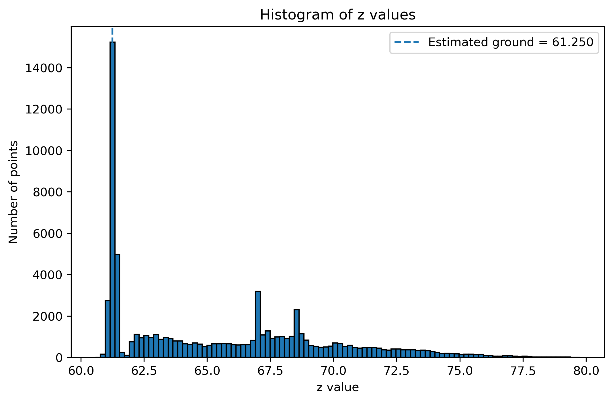
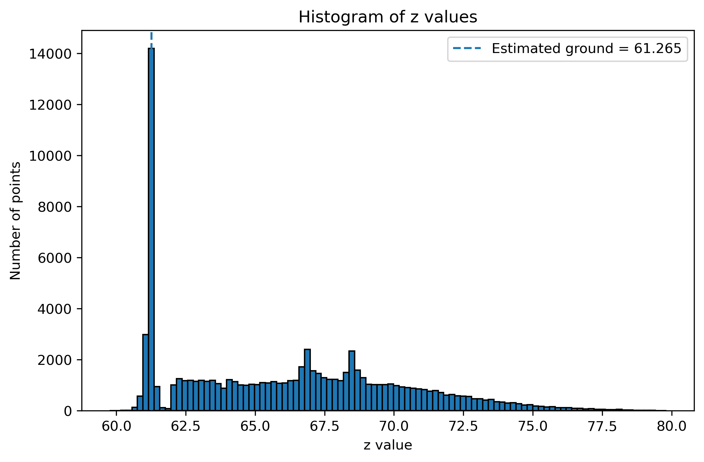
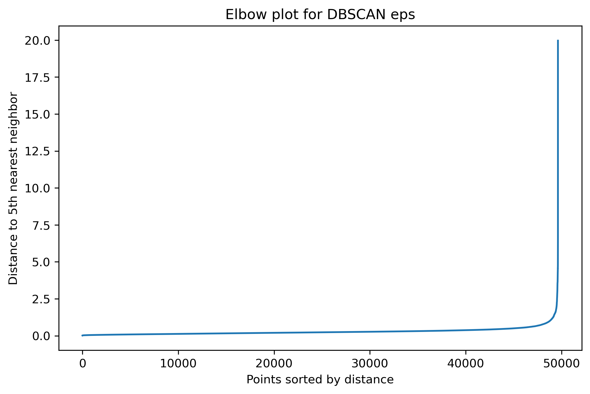
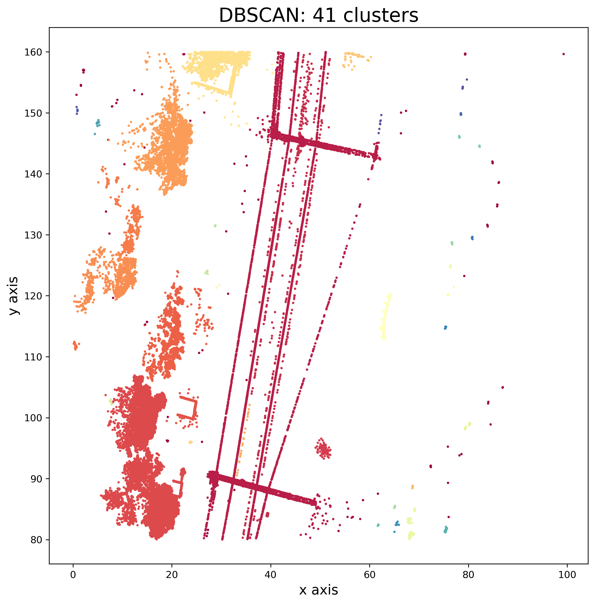
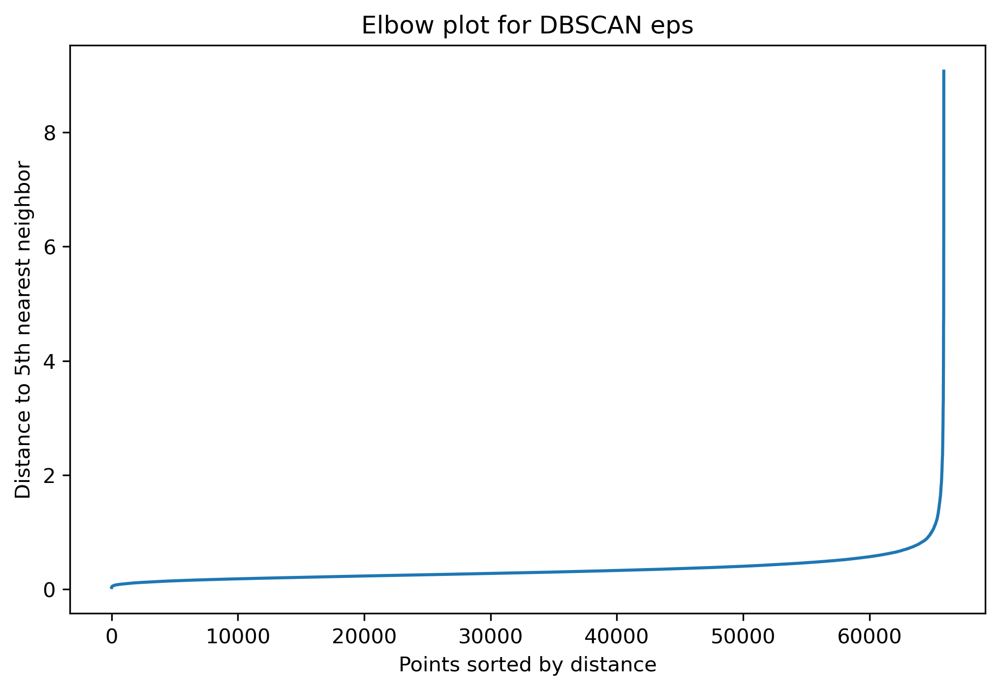
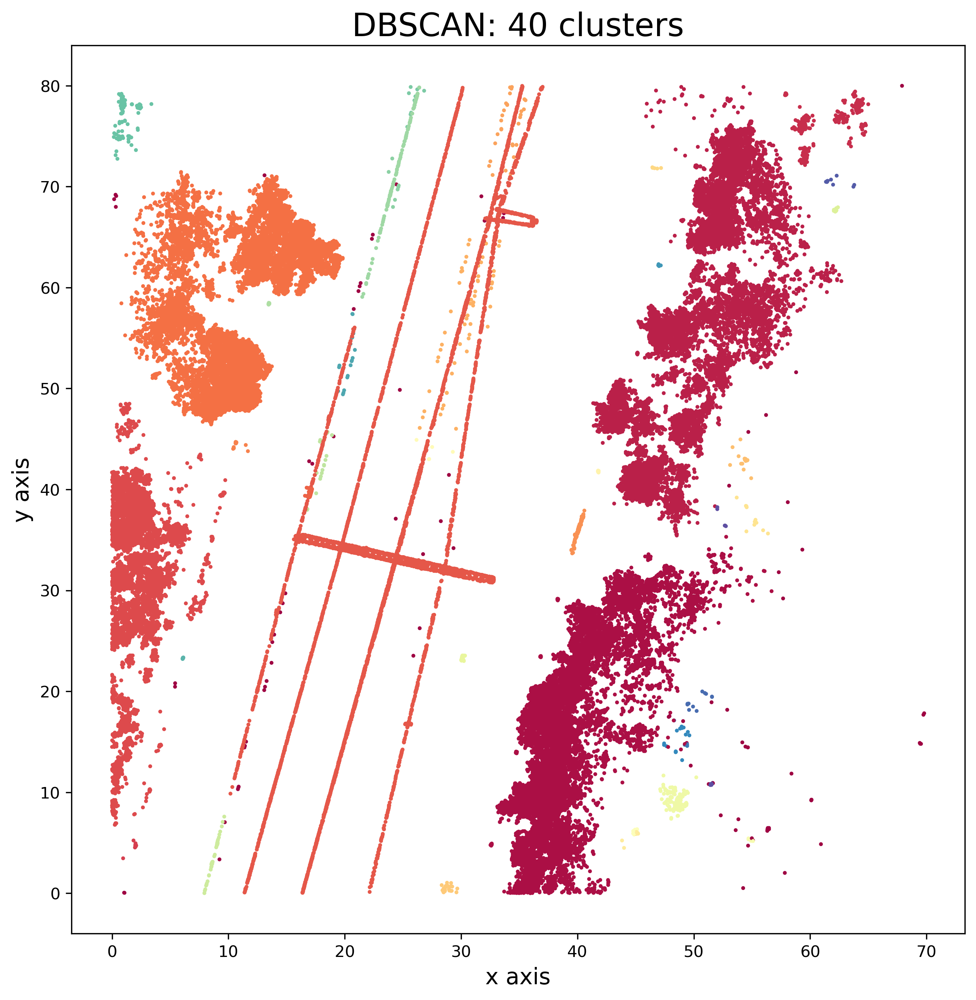
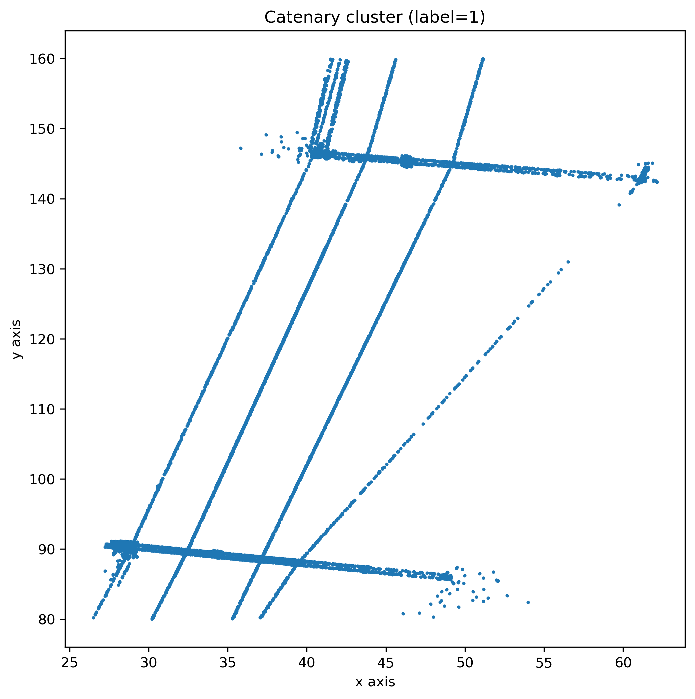
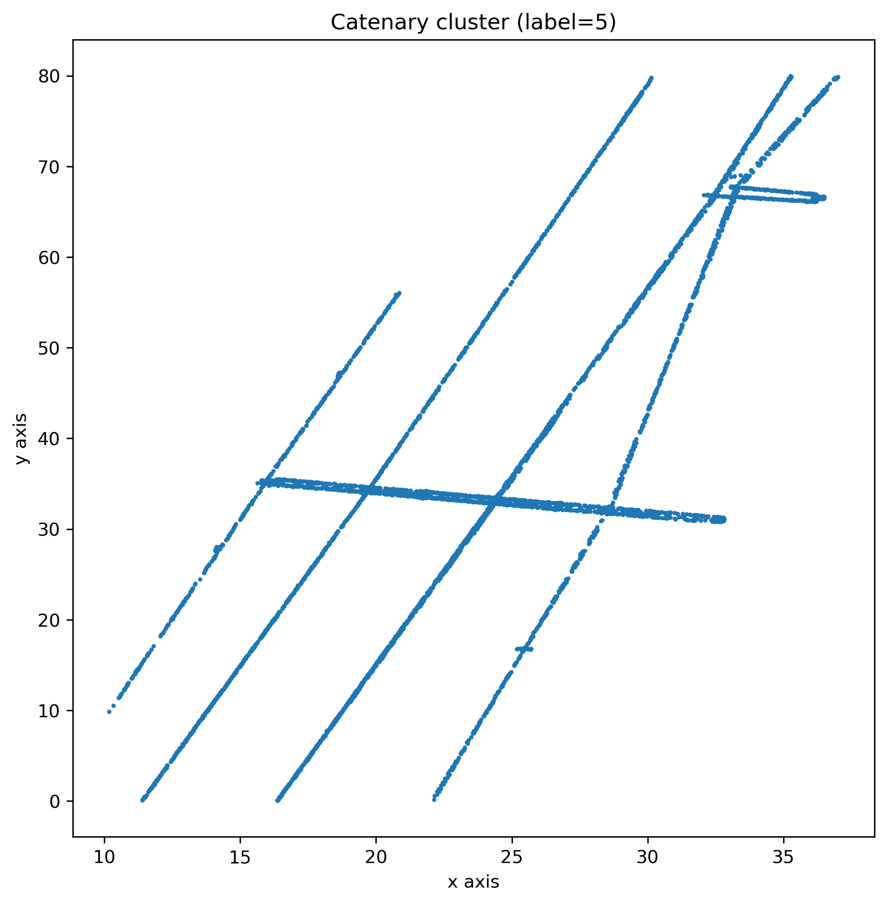

# Assignment 5 - LiDAR Point Cloud Analysis
This project contains the solution for Assignment 5 in Industrial AI. 
The work was first developed on `dataset1.npy` and then tested on `dataset2.npy`.

## Task 1 - Ground level estimation
The ground level was estimated using a histogram of the z values. 
The strongest peak in the histogramm was used as the estimated ground level.

### Dataset 1
- Estimated ground level: **61.250**

### Dataset 2
- Estimated ground level: **61.265**

---

## Task 2 - DBSCAN eps optimization

The eps value for DBSCAN was estimated using an elbow plot based on the distance to the 5th nearest neighbor.  
The selected eps value was then validated visually with the resulting cluster plot.

### Dataset 1
- Selected eps: **2.0**

### Dataset 2
- Selected eps: **2.0**

---

## Task 3 - Catenary cluster extraction

The catenary was identified as the largest meaningful cluster based on the x/y span.  
The noise cluster with label `-1` was ignored.

### Dataset 1
- Selected cluster label: **1**
- min(x): **26.498**
- max(x): **62.140**
- min(y): **80.019**
- max(y): **159.960**
- x span: **35.642**
- y span: **79.941**

### Dataset 2
- Selected cluster label: **5**
- min(x): **10.179**
- max(x): **37.007**
- min(y): **0.043**
- max(y): **79.976**
- x span: **26.828**
- y span: **79.933**

